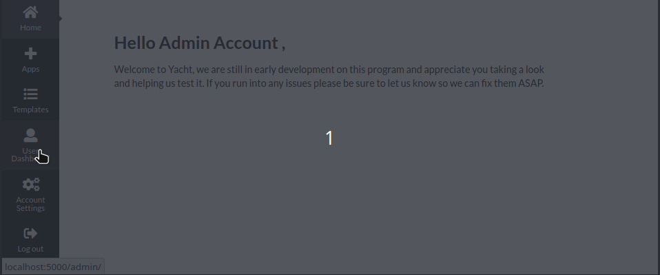

## Yacht is a flask based container management UI with a focus on templates and 1-click deployments.

## Demo:


## Installation:
Currently only linux has been verified as working but we are open to the idea of supporting windows eventually as well.

**Keep in mind, this is an Alpha so the risk of data loss is real and it may not be stable**

Once docker is installed you'll simply run the following commands to get started:
```
docker volume create yacht
docker run -d -p 5000:5000 -v /var/run/docker.sock:/var/run/docker.sock -v yacht:/config selfhostedpro/yacht:latest
```
It will be available on port 5000.
The default username is `admin@yacht.local`.
The default password is `password`.
You can change these by setting the `ADMIN_EMAIL` and `ADMIN_PASSWORD` environment variables or in the account settings within the application.

## Features So Far:
* User Management
* User and Admin Roles
* Container Templating Compatibility (Portainer Compatible)
* Semantic UI Framework
* Basic Container Management
* Template Framework
* Easy Template Updating

## Planned Features:
* Advanced Container Management (Edit, Modify, Create without a template)
* Container Monitoring
* Docker-Compose Compatibility
* Easy access to container interfaces
* Centralized settings for volume management and similar QOL functionality.

*If you want something that's not planned please open a feature request issue and we'll see about getting it added.*

## Templating:
Currently Yacht is compatible with portainer templates. You'll add a template url in the "Add Template" settings. The the template will be read, separated into apps, and imported into the database. The apps associated with the templates are linked via a db relationship so when the template is removed, so are the apps associated with it. We store the template url as well so we can enable updating templates with a button press.

We recommend starting with: https://raw.githubusercontent.com/SelfhostedPro/selfhosted_templates/yacht/Template/template.json


## Dev Info:
**Documentation for the boilerplate available at [http://hack4impact.github.io/flask-base](http://hack4impact.github.io/flask-base) and [https://github.com/hack4impact/flask-base](https://github.com/hack4impact/flask-base).**

## Setting up
##### Initialize a virtual environment

Windows:
```
$ python3 -m venv venv
$ venv\Scripts\activate.bat
```

Unix/MacOS:
```
$ python3 -m venv venv
$ source venv/bin/activate
```
Learn more in [the documentation](https://docs.python.org/3/library/venv.html#creating-virtual-environments).

Note: if you are using a python before 3.3, it doesn't come with venv. Install [virtualenv](https://docs.python-guide.org/dev/virtualenvs/#lower-level-virtualenv) with pip instead.

##### (If you're on a Mac) Make sure xcode tools are installed

```
$ xcode-select --install
```

##### Add Environment Variables

Create a file called `config.env` that contains environment variables. **Very important: do not include the `config.env` file in any commits. This should remain private.** You will manually maintain this file locally, and keep it in sync on your host.

Variables declared in file have the following format: `ENVIRONMENT_VARIABLE=value`. You may also wrap values in double quotes like `ENVIRONMENT_VARIABLE="value with spaces"`.

1. In order for Flask to run, there must be a `SECRET_KEY` variable declared. Generating one is simple with Python 3:

   ```
   $ python3 -c "import secrets; print(secrets.token_hex(16))"
   ```

   This will give you a 32-character string. Copy this string and add it to your `config.env`:

   ```
   SECRET_KEY=Generated_Random_String
   ```

2. The mailing environment variables can be set as the following.
   We recommend using [Sendgrid](https://sendgrid.com) for a mailing SMTP server, but anything else will work as well.

   ```
   MAIL_USERNAME=SendgridUsername
   MAIL_PASSWORD=SendgridPassword
   ```

Other useful variables include:

| Variable        | Default   | Discussion  |
| --------------- |-------------| -----|
| `ADMIN_EMAIL`   | `flask-base-admin@example.com` | email for your first admin account |
| `ADMIN_PASSWORD`| `password`                     | password for your first admin account |
| `DATABASE_URL`  | `data-dev.sqlite`              | Database URL. Can be Postgres, sqlite, etc. |
| `RAYGUN_APIKEY` | `None`                         | API key for [Raygun](https://raygun.com/raygun-providers/python), a crash and performance monitoring service |
| `FLASK_CONFIG`  | `default`                      | can be `development`, `production`, `default`, `heroku`, `unix`, or `testing`. Most of the time you will use `development` or `production`. |


##### Install the dependencies

```
$ pip install -r requirements.txt
```

##### Other dependencies for running locally

You need [Redis](http://redis.io/), [Sass](http://sass-lang.com/), and [Postgresql](https://www.postgresql.org/). Chances are, these commands will work:

**Sass:**

```
$ gem install sass
```

**PostgresQL**

_Mac (using homebrew):_

```
brew install postgresql
```

_Linux (based on this [issue](https://github.com/hack4impact/flask-base/issues/96)):_

```
sudo apt-get install libpq-dev
```


##### Create the database

```
$ python manage.py recreate_db
```

##### Other setup (e.g. creating roles in database)

```
$ python manage.py setup_dev
```

Note that this will create an admin user with email and password specified by the `ADMIN_EMAIL` and `ADMIN_PASSWORD` config variables. If not specified, they are both `flask-base-admin@example.com` and `password` respectively.

## Running the app

```
$ source env/bin/activate
$ honcho start -e config.env -f Local
```

For Windows users having issues with binding to a redis port locally, refer to [this issue](https://github.com/hack4impact/flask-base/issues/132).


## Gettin up and running with Docker

Currently we have a `Dockerfile` intended for testing purposes and it automates the whole cycle of running the application, setting up the database and redis. 

##### Note

A more robust version with docker-compose is being developed to separate redis in separate container and allow the deployment of production-level applications automatically without the need of manual provisioning

## Formatting code

Before you submit changes to flask-base, you may want to autoformat your code with `python manage.py format`.

## License
[MIT License](LICENSE.md)
